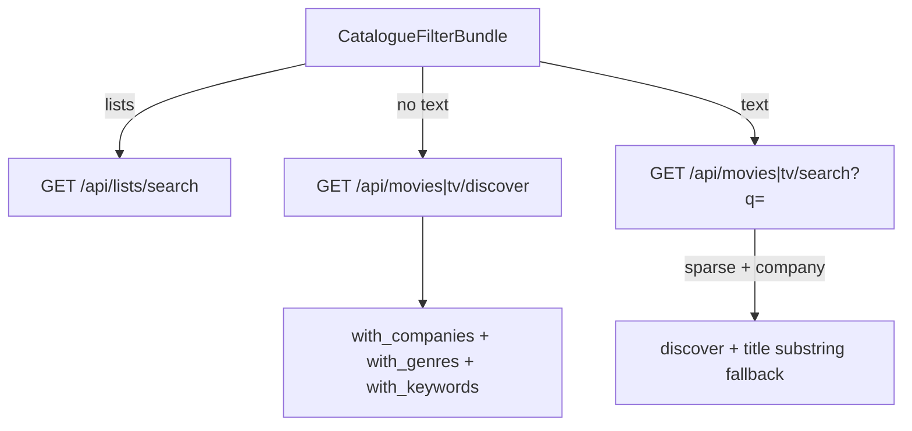

# Search dialog: catalogue tags v2 (genres, curated, TV studios)

**Status:** Approved (brainstorm 2026-05-20)  
**Date:** 2026-05-20  
**Scope:** `HomeStickySearch` tagged query bar (extends v1)  
**Builds on:** `docs/superpowers/specs/2026-05-20-search-dialog-tagged-query-design.md` (v1 shipped)

## Summary

Extend the home search **token field** with **TMDb genre pills** (multiple, AND), **curated shortcuts** (starting with **Anime**), and **studio filters on both Films and TV**. Patrons Tab-commit tags, then type free text; all active catalogue filters combine with TMDb AND semantics.

Example: `ani` → Tab → **Anime** → `hor` → Tab → **Horror** → `a24` → Tab → **A24** → `tv` → Tab → **TV shows** → `chainsaw` → debounced TV results matching studio, genres/curated rules, and title.

## Decisions (locked)

| Topic | Decision |
|--------|----------|
| Tag model | **Hybrid (C):** official TMDb genres + small curated set |
| Genre count | **Multiple genre/curated pills (C)** — TMDb `with_genres` AND (comma-separated) |
| Anime + genres | **Stack AND (B):** Anime curated rules apply together with any genre pills |
| Studio scope | **Films and TV** — `with_companies` on discover and search for both media kinds |
| Studio count | **One** studio pill (unchanged from v1) |
| Media pill | **One** `movie` or `tv` pill (unchanged) |
| Lists tag | **Exclusive** — clears catalogue tags; unchanged auth/scope (own lists only) |
| Implementation shape | **Extend v1 in place (approach 1)** + extract `use-catalogue-tag-search.ts` to cap `home-sticky-search.tsx` growth |
| Visual chrome | Pills: **`bg-background` + `shadow-sm`** on **`bg-card`**; **no rings** on selection |

## User experience

### Query bar

```
[ A24 | × ] [ TV shows | × ] [ Anime | × ] [ Horror | × ]  chainsaw█
```

- **Genre pill:** TMDb display name (e.g. Horror, Animation).
- **Curated pill:** Patron-facing label (e.g. Anime); implemented as fixed TMDb rule bundle behind the scenes.
- **Studio pill:** logo + name (unchanged).
- **Media / Lists pills:** unchanged from v1.

### Suggestion panel

- Groups: **Studios · Genres · Type · Lists** (genre rows before type when both match).
- Prefix match on genre names + curated aliases (`ani` → Anime, Animation).
- **Studios** suggested regardless of media pill (remove v1 TV-only studio block).
- Max **~8** rows; **44px** min height; Tab / Enter / tap to commit.
- **`prefers-reduced-motion`:** instant pills, no ghost animation.

### Chrome under the bar

- Hide **Films / TV** fieldset when **`media`** pill is set.
- **Remove** copy “Studios filter Films only.”
- Optional muted hint when **3+** genre/curated pills: “All tags must match.” (`text-xs` only).

### Result column

| Tags + text | Results |
|-------------|---------|
| None | Unchanged empty browse (recents, rail, studio logos, 4-poster preview) |
| Catalogue tags, no text | Discover for active `listingKind` with `with_companies`, `with_genres`, `with_keywords` as applicable |
| Catalogue tags + text | Debounced search + discover fallback (same strategy as v1 movie company filter) |
| `lists` | User list rows (unchanged) |

**Over-constrained empty:** “Nothing matched all filters — try removing a tag.” (no layout shift; keep pill row).

**Loading:** skeleton poster grid / list skeleton; dim stale results; no “Searching…” paragraph.

### Recents

- Serialize with middle dot: `A24 · TV shows · Anime · Horror · chainsaw`.
- Order: studio → media → genre/curated pills in commit order → free text.
- Parse restores all kinds; legacy plain strings remain free-text-only.

### Empty browse

Unchanged when no tags and no free text.

## Tag vocabulary (v2)

| Kind | Triggers (prefix) | Pill | Limit |
|------|-------------------|------|-------|
| `studio` | Curated studio rail names | Name + logo | 1 |
| `media` | `movie`/`films`, `tv`/`shows` | Films / TV shows | 1 |
| `genre` | TMDb genre name for active media kind | Genre name | Many (AND) |
| `curated` | Curated aliases (e.g. `ani` → Anime) | Curated label | Many (AND) |
| `lists` | `list`/`lists` | Lists | 1 (exclusive mode) |

### Curated: Anime (initial)

| Media | TMDb discover params |
|-------|----------------------|
| Movie | `with_genres=16` (Animation) + `with_keywords=210024` (anime keyword) |
| TV | TV Animation genre id (from `/genre/tv/list`) + same anime keyword id |

Implementer verifies ids against live TMDb genre lists for the deployment locale. Additional curated slugs can be added in the same map without UI changes.

## Architecture

### Client types

```ts
type SearchTag =
  | { kind: "studio"; id: number; name: string; logoUrl: string | null }
  | { kind: "media"; listingKind: "movie" | "tv" }
  | { kind: "genre"; id: number; name: string; listingKind: "movie" | "tv" }
  | { kind: "curated"; slug: string; label: string }
  | { kind: "lists" };
```

Derived bundle for fetch hook:

```ts
type CatalogueFilterBundle = {
  studioId: number | null;
  listingKind: "movie" | "tv";
  genreIds: number[];       // TMDb AND
  keywordIds: number[];     // curated → keywords, AND
  resultMode: "catalogue" | "lists";
  freeText: string;
};
```

Genre suggestions use **movie genre list** when `listingKind === "movie"` (or default), **TV genre list** when `listingKind === "tv"`.

### Modules

| File | Action | Role |
|------|--------|------|
| `apps/web/src/lib/search-query-tags.ts` | Modify | Genre/curated kinds, ranking, upsert, serialize/parse |
| `apps/web/src/lib/search-curated-tags.ts` | Create | Curated slug → label + per-media TMDb params |
| `apps/web/src/lib/use-catalogue-tag-search.ts` | Create | Replaces/extends `use-structured-catalog-search` orchestration |
| `apps/web/src/lib/still-api-fetch.ts` | Modify | TV genres, discover/search query params |
| `apps/web/src/components/home/search-tag-pill.tsx` | Modify | Render genre/curated labels |
| `apps/web/src/components/home/search-token-field.tsx` | Modify | Genre suggestion group |
| `apps/web/src/components/home/home-sticky-search.tsx` | Modify | Wire hook; remove Films-only studio copy |
| `apps/server/src/lib/tmdb.ts` | Modify | `discoverTv`: `withCompanies`, `withKeywords` |
| `apps/server/src/routes/tv.ts` | Modify | `/discover` + `/search` company/genre/keywords |
| `apps/server/src/routes/movies.ts` | Modify | Multi-genre/keywords on discover/search when needed |
| `apps/server/src/lib/search-curated-tags.ts` | Create (optional mirror) | Server-side curated constants |

### Search orchestration



- **Debounce:** ~240ms (unchanged).
- **Cap:** 20 poster results in dialog.
- **TV + company on text search:** mirror movie verification/fallback pattern.

### Server API additions

**`GET /api/tv/genres`** — `{ genres: { id, name }[] }` via `genre/tv/list`.

**`GET /api/tv/discover`** — add optional query params:

- `company` (int) → `with_companies`
- `genre` (comma-separated ints) → `with_genres` AND
- `keywords` (comma-separated ints) → `with_keywords` AND

**`GET /api/tv/search`** — add optional `company`, `genre`, `keywords`; filter/fallback analogous to movies.

**`GET /api/movies/discover` / `search`** — accept comma-separated `genre` and `keywords` when not already present.

## Phasing (implementation)

| Phase | Deliverable | Success criteria |
|-------|-------------|------------------|
| **V2.1** | Types + genre suggestions + pills | Tab commits Horror; multiple genre pills AND; serialize/parse in tests |
| **V2.2** | TV discover/search `company` + hook bundle | A24 + TV + text returns TV rows; no Films-only studio UI |
| **V2.3** | Curated Anime + `/api/tv/genres` | `ani` → Anime pill; Anime + Horror + TV discover returns rows or clear empty |
| **V2.4** | Recents + a11y + empty copy | Recent chip restores genre pills; live region counts; over-filter message |

## Patron locale (V2.5 — planned, appended 2026-05-20)

| Topic | Decision |
|--------|----------|
| Settings | New **catalogue language** preference (`catalogTmdbLanguage` → TMDb `language` code), separate from **watch region** (streaming geography unchanged). |
| Default | Unset → derive language from existing `catalogTmdbWatchRegion` map; then `en-US`. |
| Search tags | Genre fetch + Tab match + pill labels + recents parse use **localized** TMDb genre names (e.g. `Terror` when locale is Spanish). |
| Curated pills | Stay fixed patron-facing labels in v2.5 (Anime, …); optional translated curated table later. |
| Interim | V2.1 may ship `en-US`-only genre autocomplete as a stopgap; **remove** when V2.5 lands. |
| UI i18n | Stretch: Settings/search chrome strings via message catalogs; not required for Terror/Horror tag fix. |

## Out of scope (v2 core)

- People, year, rating tags as pills (language **preference** is V2.5, not a free-text pill).
- Multiple studios in one query.
- OR semantics between genre pills (only AND).
- Public/community list discovery.
- Natural-language query syntax.
- Genre picker grid UI (token + suggestions only).

## Risks

| Risk | Mitigation |
|------|------------|
| AND filters return zero rows | Explicit empty copy; optional 3+ tag hint |
| Movie vs TV genre id mismatch | Separate lists per `listingKind`; genre pill stores kind |
| Anime keyword too narrow/broad | Tune curated map; document ids in server constants |
| TV search lacks company on summary rows | Same discover fallback as movies |
| `home-sticky-search.tsx` size | Extract `use-catalogue-tag-search.ts` in V2.1 |

## Testing (manual)

1. `hor` → Tab → Horror → `mov` → Tab → Films → see film discover/search filtered.
2. Anime + Horror + TV + text → results or clear “nothing matched all filters”.
3. A24 + TV + `marty` → TV results scoped to company (not all marty titles worldwide).
4. Lists tag still exclusive; signed-out lists → sign-in hint.
5. Recent chip restores studio + genres + media + text.
6. Dialog open: no horizontal scrollbar; height fits content; skeletons on load.
7. `prefers-reduced-motion`: no pill/ghost jank.

### Testing (V2.5 — locale)

8. Settings → Español → search `ter` → Tab → **Terror** pill; English → `hor` → **Horror**.
9. Watch region and catalogue language can differ (e.g. US region + Spanish genres).

## Approval

- [x] Hybrid tag model (C)
- [x] Multiple genres (C)
- [x] Anime stacks with genres AND (B)
- [x] Sections 1–3 approved in brainstorm
- [x] User review of this spec file
- [x] Ready for implementation plan (`writing-plans`) — `docs/superpowers/plans/2026-05-20-search-dialog-catalogue-tags-v2.md`
