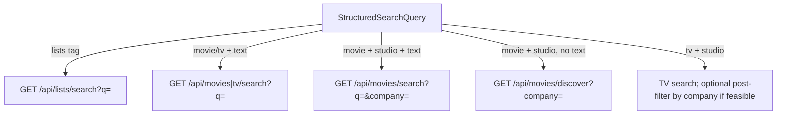

# Search dialog: tagged query bar

**Status:** Approved  
**Date:** 2026-05-20  
**Scope:** `HomeStickySearch` (home sticky search dialog on `/home`)

## Summary

Replace the plain-text search field with a **token field**: typed tokens can be committed with **Tab** (or tap on a suggestion) into **pills**, then free text runs search against the active tags. Supports **studio**, **media** (films vs TV), and **lists** tags. Studio pills show the TMDb logo on the left.

Example: `a24` → Tab → A24 pill → `movie` → Tab → Films pill → type `marty` → debounced results for A24 films matching “marty”.

## Decisions (locked)

| Topic | Decision |
|--------|----------|
| Lists tag scope | **A — signed-in user’s own lists only** (`list.userId = me`). No public/community lists in v1. |
| UI pattern | **Token field + Tab ghost** (Approach 1). Not a query mini-language as primary UX. |
| Studio count | **One** studio pill at a time (new studio replaces previous). |
| Media tag | **One** `movie` or `tv` pill; replaces Films/TV toggle when present. |
| `lists` vs `movie`/`tv` | **Mutually exclusive result mode** — `lists` tag switches to list rows; film/TV tags hidden or ignored for results. |
| Visual chrome | Pills use **`bg-background` + `shadow-sm`** on dialog **`bg-card`**; **no rings/borders** for selection (Still overlay rules). |
| Empty query | Unchanged empty browse (studios rail, popular preview) when no tags and no free text. |

## User experience

### Query bar

```
[ A24 | × ] [ Films | × ]  marty█
                              ↑ ghost: "Tab → Films" (when applicable)
```

- **Pills:** non-editable; remove with × or Backspace on empty input.
- **Studio pill:** small logo (TMDb `w92`) + short name; same asset source as `GET /api/movies/studios`.
- **Media pill:** label “Films” or “TV shows” (no logo).
- **Lists pill:** label “Lists”.
- **Ghost:** inline muted completion for the **current token** only; optional “Tab” hint on desktop.
- **Suggestion panel:** shown while the current token has matches; groups **Studios · Type · Lists**; max ~6 items; 44px min row height; commit on Tab, Enter, or tap.

### Tag vocabulary (v1)

| Kind | Token triggers (case-insensitive prefix) | Pill | Search behavior |
|------|------------------------------------------|------|-----------------|
| `studio` | Studio names/aliases from curated rail (e.g. `a24`, `neon`) | Name + logo | Constrains film catalogue to TMDb `with_companies` |
| `media` | `movie`, `movies`, `film`, `films` → movie; `tv`, `show`, `shows` → tv | Films / TV shows | Sets `listingKind` for TMDb text search |
| `lists` | `list`, `lists` | Lists | Search **user’s lists** by title (auth required) |

### Interaction rules

- **Tab:** commit top suggestion for active token.
- **Enter:** if suggestions open, commit highlighted; else submit / focus first result.
- **Escape:** close suggestions; do not close dialog.
- **Arrow keys:** move within suggestion list (roving focus).
- **`prefers-reduced-motion`:** no ghost animation; instant pill mount.
- **Touch:** no Tab required; tap suggestion to commit.

### Result column (while typing)

| Tags + text | Results |
|-------------|---------|
| None | Current behavior: TMDb search by `searchListingKind` toggle |
| `studio` only | Discover preview (popular by company), same as studio rail |
| `media` only | Optional: no results until text, or popular for that kind |
| `studio` + `media` + text | Combined search (see API) |
| `lists` | User list rows (title match); film posters from list cover metadata |
| `lists` + text | Filter/rank user lists by title containing text |

Hide **Films / TV** fieldset under the bar when a `media` pill is set.

### Auth

- **Lists tag:** if not signed in, show inline empty state (“Sign in to search your lists”) and do not call list API.
- Studio/media/search unchanged for anonymous users (TMDb).

## Architecture

### Client state

```ts
type SearchTag =
  | { kind: "studio"; id: number; name: string; logoUrl: string | null }
  | { kind: "media"; listingKind: "movie" | "tv" }
  | { kind: "lists" };

type StructuredSearchQuery = {
  tags: SearchTag[];
  freeText: string; // current input segment after pills
};
```

Derived:

- `activeStudioId`, `listingKind`, `resultMode: "catalogue" | "lists"`.
- Debounced fetch key: serialized tags + `freeText`.

### New / updated modules

| File | Role |
|------|------|
| `apps/web/src/lib/search-query-tags.ts` | Types, tokenization, suggestion ranking, serialize/deserialize for recents |
| `apps/web/src/components/home/search-token-field.tsx` | Chip + input + ghost + suggestion list (`use client`) |
| `apps/web/src/lib/use-structured-catalog-search.ts` | Debounced orchestration of APIs from structured query |
| `apps/web/src/components/home/home-sticky-search.tsx` | Integrate token field; conditional results UI |

Reuse: `useSearchDialogStudios`, `findSearchDialogStudio`, `SearchDialogStudioRail` data for studio suggestions.

### Server

**1. Film search with studio constraint**

Extend `GET /api/movies/search`:

- Query: `q` (required), optional `company` (TMDb company id).
- Behavior: call TMDb `/search/movie` with `query=q`; if `company` set, filter results where `company_ids` includes that id (or use discover + title match if search metadata is insufficient — implementer verifies TMDb payload).

**2. User list search**

New `GET /api/lists/search` (auth):

- Query: `q` optional (empty = recent user lists, capped).
- Scope: `where list.userId = user.id`, `title` ILIKE `%q%`, order `updatedAt desc`, limit 20.
- Response: same enriched shape as `/api/lists/me` (cover poster paths).

**3. No change** to `/api/movies/studios` (autocomplete source).

### Search orchestration (client)



TV + studio in v1: run TV search; if TMDb does not expose company on TV search hits, document limitation in UI (studio pill applies to Films only) or omit studio+tv combo in suggestions.

### Recents (phase 4)

Store serialized query strings in existing `still.home-search-recent` (e.g. `A24 · Films · marty`). Parsing on pick restores pills + text.

## Phasing

| Phase | Deliverable | Success criteria |
|-------|-------------|------------------|
| **1** | `SearchTokenField` + studio & media tags + suggestions + Tab | Pills render; Tab commits; Backspace removes; no regressions on plain text-only search |
| **2** | `company` on movie search + `useStructuredCatalogSearch` | A24 + Films + `marty` returns relevant film rows < 300ms debounced |
| **3** | Lists tag + `GET /api/lists/search` + list result rows | Signed-in user sees own lists; guest sees sign-in hint |
| **4** | Recents serialization + a11y pass | Screen reader announces pills; keyboard path documented |

## Out of scope (v1)

- People, genre, year tags.
- Multiple studios in one query.
- Public/community list discovery via tags.
- Natural-language queries.
- Replacing ⌘K command palette (may share types later).

## Risks

| Risk | Mitigation |
|------|------------|
| TMDb movie search lacks reliable company on results | Filter using `company_ids` from search payload; fallback discover + client title filter |
| TV + studio | v1: studio tag only suggested when `media` is movie; or clear “Studios apply to Films” copy |
| Token field a11y complexity | Follow Emil checklist: aria labels on pills, `aria-autocomplete`, live region for result count |
| `home-sticky-search.tsx` size | Extract token field and result list subcomponents |

## Testing (manual)

1. Open search → type `a24` → Tab → pill with logo → type `marty` → see film results.
2. Add Films tag via `mov` + Tab → results stay movies.
3. Lists tag → only own lists; signed out → sign-in message.
4. Empty state unchanged with no tags/text.
5. Reduced motion: no jank on pill insert.

## Approval

- [x] Lists scope: **own lists only** (user confirmed “1” = option A)
- [x] Full design approved by user
- [x] Ready for implementation plan (`writing-plans`)
