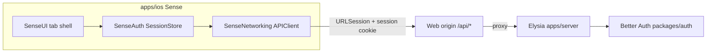

# Sense iOS — Slice 1: Foundation

**Date:** 2026-09-09
**Status:** Approved design, pending implementation plan
**App:** `apps/ios` (new — SwiftUI)
**Program:** `2026-09-09-sense-ios-near-web-roadmap-design.md` (slice 1 of 15)

## Context

The roadmap commits Sense to a true native iOS app covering near-web feature
coverage, built slice by slice, Home-first. This spec covers **slice 1 only**: the
shell everything else is built on.

Foundation is done when an existing patron can install the app, sign in three
ways, land on a five-tab Sense app, see their own identity, and sign out — and
when the repository has exactly one mobile client (the Expo app is gone).

No catalogue, no logging, no Community. Those are slices 2–5.

## Decisions

| Decision | Choice | Rationale |
|---|---|---|
| Project location | New Xcode app at `apps/ios`, display name **Sense** | Sits beside `apps/web` / `apps/server`; outside Turbo's task graph (Xcode builds it). |
| Project definition | **XcodeGen** — commit `project.yml`, generate `Sense.xcodeproj`, git-ignore the generated bundle | A `.xcodeproj` is a generated bundle that merges badly and that agents edit unreliably; a YAML source of truth is reviewable and reproducible. |
| Code organisation | Three local Swift packages: `SenseNetworking`, `SenseAuth`, `SenseUI` | Keeps logic testable without a simulator and stops slice 2+ from growing one giant app target. |
| Base URL | The **web origin** (`BETTER_AUTH_URL` host), which forwards `/api/*` to Elysia | One host for auth callbacks and API calls, so the cookie jar just works. |
| Session transport | App-managed credential in the Keychain, injected as a `Cookie` header; automatic cookie handling **off** | `ASWebAuthenticationSession` runs in the system browser, whose cookie jar iOS does not share with `URLSession`. One explicit mechanism beats a jar that works for two sign-in methods and silently fails for the third. |
| Native OAuth bridge | Keep Better Auth's `expo()` **server** plugin | It already appends the session `set-cookie` to the `still://` deep link, which is the only supported way the app can receive a browser-issued session. Proven in this repo. |
| Sign-in methods | Email/password, Sign in with Apple, Discord | Matches the website; Apple is required by App Review once Discord login is offered. |
| Who can use it | Existing onboarded patrons; sign-up is allowed but un-onboarded accounts are gated to the website | The onboarding wizard is slice 11; building a native wizard now would block foundation. |
| Expo app | Deleted in this slice | One mobile track; a stale second client is worse than none. |
| Deployment target | iPhone, iOS 17+ | `@Observable`, modern `NavigationStack` and `TabView` behavior without back-compat branches. |

## Scope

**In scope**

- Xcode project at `apps/ios` with Debug/Release configuration and the three local packages.
- Networking layer: base URL from build configuration, cookie-backed session, typed error handling.
- Auth: sign in (email, Apple, Discord), sign up (email), sign out, session restore on launch.
- Onboarding gate: un-onboarded accounts are sent to the website to finish setup.
- Five-tab shell: Home · Search · Log · Inbox · You.
- `SenseUI` token layer: colors, typography scale, spacing, light/dark.
- **You** tab renders the signed-in patron (display name, `@handle`, portrait) and Sign out.
- Removal of `apps/native` and its monorepo wiring.
- Server-side: Apple social provider registered in `packages/auth`, plus the iOS redirect configuration.

**Out of scope (later slices)**

- Home catalogue, Community, search, title detail, Quick Log, diary, lists, profiles of other patrons, reviews, notifications, settings, billing, achievements, quotes, year-in-review.
- Native onboarding wizard (slice 11).
- Push notifications, widgets, iPad layouts, offline caching, the web palette picker.
- Android.

## Architecture

```
apps/ios/
  project.yml                   # XcodeGen source of truth (committed)
  Sense.xcodeproj               # generated, git-ignored
  Sense/
    SenseApp.swift              # @main; injects SessionStore; root switches auth ↔ shell
    RootView.swift              # launching / signed-out / needs-onboarding / signed-in
    Shell/
      MainTabView.swift         # 5 tabs
      PlaceholderTab.swift      # "Coming soon" body used by Home/Search/Log/Inbox
      YouTab.swift              # identity + Sign out
    Auth/
      SignInView.swift          # email fields + Apple button + Discord button
      SignUpView.swift          # email sign-up
      FinishSetupView.swift     # un-onboarded gate → website
    Resources/
      Assets.xcassets           # app icon, accent, Sense color set
      Info.plist                # URL scheme `still`, ATS exception (Debug only)
  Packages/
    SenseNetworking/            # APIClient, APIError, base URL, cookie storage
      Sources/ + Tests/
    SenseAuth/                  # SessionStore, auth calls, PatronSession, onboarding gate
      Sources/ + Tests/
    SenseUI/                    # tokens, Text styles, PatronPortrait, buttons
      Sources/
  SMOKE.md                      # simulator checklist
```

Tests live inside each package (standard SwiftPM layout) so `swift test` runs the
logic suites without opening Xcode. `SenseUI` has no test target in this slice —
it is tokens and two views.



### Why the web origin, not the Elysia host

`BETTER_AUTH_URL` is the **web** origin, and `apps/web/src/proxy.ts` forwards
`/api/*` to Elysia (`apiUpstreamOrigin()`), where Better Auth is mounted at
`/api/auth/*` (`apps/server/src/server/app.ts`). Better Auth builds its OAuth
callback URLs from `BETTER_AUTH_URL`, so a Discord round-trip ends on the web
host and sets the session cookie for that host.

If the app called Elysia directly it would hold cookies for one host and complete
OAuth on another — the exact cross-host session bug recorded for the web app.
Pointing the app at the web origin keeps auth and data on a single host.

Consequences to respect in this slice:

- Local development uses `http://localhost:3001` (web), not `:3000` (API). A
  physical device needs the machine's LAN IP with `BETTER_AUTH_URL` and
  `CORS_ORIGIN` set to match; the simulator can use `localhost`.
- Cleartext HTTP is allowed only in the **Debug** build's ATS configuration.
  Release is HTTPS-only.
- Multipart uploads are known to break through generic Next rewrites. Nothing in
  this slice uploads; slices that do must use the same dedicated route-handler
  pattern the web uses.

### SenseNetworking

- `APIEnvironment` — base URL resolved from the build configuration (Debug: local
  web origin; Release: production web origin). No hardcoded host in view code.
- `APIClient` — `async` request method over a `URLSession` with automatic cookie
  handling **disabled** (`httpShouldSetCookies = false`,
  `httpCookieAcceptPolicy = .never`). Every request carries the stored credential
  as a `Cookie` header, plus `expo-origin: still://` so the server plugin's origin
  override accepts a non-browser client. JSON decoding handles the API's ISO-8601
  timestamps.
- `SessionCredentialStore` — parses `Set-Cookie` response headers with
  `HTTPCookie.cookies(withResponseHeaderFields:for:)`, keeps the surviving
  name/value/expiry set in the Keychain, drops expired entries, and renders the
  `Cookie` header. This mirrors what the Expo client did in JavaScript.
- `APIError` — `unauthorized` (401), `http(status:)`, `decoding`, `transport`.
  `unauthorized` is what tells `SessionStore` to sign out.
- Cancellation propagates; cancelled requests must not surface as errors (the
  same `AbortError` lesson from the web client).

### SenseAuth

- `PatronSession` — `userId`, `displayName`, `handle`, `portraitURL`,
  `onboardedAt`, `createdAt`. Decoded from `GET /api/profiles/me`.
- `SessionStore` (`@Observable`) — states `launching`, `signedOut`,
  `needsOnboarding(PatronSession)`, `signedIn(PatronSession)`. On launch it calls
  `GET /api/profiles/me`; a valid cookie restores the session with no visible
  sign-in step.
- Auth calls hit Better Auth under `/api/auth/*`. Two of the three are direct API
  calls whose `Set-Cookie` the app stores; only Discord needs the browser bridge.
  - **Email sign-in / sign-up** — `POST /sign-in/email` and `/sign-up/email`,
    store the returned credential, then load `profiles/me`.
  - **Apple** — native `ASAuthorizationAppleIDProvider`, then
    `POST /sign-in/social` with `provider: "apple"` and `idToken: { token, nonce }`.
    No redirect happens, so this path works against a local HTTP dev server even
    though Apple's *web* flow forbids non-HTTPS return URLs.
  - **Discord** — the three-hop bridge the Expo client used:
    1. `POST /sign-in/social` with `provider: "discord"` and a `still://` `callbackURL`
       returns `{ redirect: true, url }` plus the OAuth state cookie.
    2. Open `ASWebAuthenticationSession` at
       `/api/auth/expo-authorization-proxy?authorizationURL=<url>&oauthState=<state>`
       so the state cookie is set **in the browser**, then it redirects to Discord.
    3. Discord returns to `/api/auth/callback/discord`; the `expo()` plugin appends
       the session `set-cookie` to the `still://` redirect as a `cookie` query
       parameter. The app reads that parameter and stores the credential.
  - **Sign out** — `POST /sign-out`, then clear the Keychain credential and reset
    to `signedOut`.
- `patronNeedsOnboarding(_:)` — a Swift port of
  `apps/web/src/lib/onboarding-gate.ts`: `onboardedAt` present means done;
  otherwise a non-empty handle on a profile created before the v3 launch
  (2026-06-14) counts as legacy-complete; anything else needs onboarding. Ported
  as a pure function with the web rules' own test cases.

### SenseUI

Token layer only — no feature components.

- `SenseColor` — background, card, foreground, muted foreground, accent, plus
  light/dark values, defined as asset color sets so system chrome tints correctly.
- `SenseFont` — the type scale used by later slices (title, headline, body,
  caption), Dynamic Type aware.
- `PatronPortrait` — circular async image with initials fallback. Plan-tier auras
  are **not** in this slice.
- `SenseButtonStyle` — primary and secondary, used by the auth screens.

### App shell

`MainTabView` with five tabs, SF Symbols, and `NavigationStack` per tab so slice
2+ can push without restructuring:

| Tab | Symbol | Slice 1 content |
|---|---|---|
| Home | `house` | Placeholder — "Your Sense home lands here soon" |
| Search | `magnifyingglass` | Placeholder |
| Log | `plus.circle.fill` | Placeholder |
| Inbox | `bell` | Placeholder |
| You | `person` | Real: portrait, display name, `@handle`, Sign out |

The Log tab is a normal tab in this slice. Whether it becomes a modal action
(rather than a selectable tab) is decided in slice 5, when there is something to
present.

### Onboarding gate

If `patronNeedsOnboarding` is true, the app shows `FinishSetupView` instead of the
tab shell: an explanation plus a button that opens `/onboarding` on the web origin
in `SFSafariViewController`, and a "I've finished" button that re-fetches
`profiles/me`. There is no way to reach the tabs while un-onboarded — matching the
web `(app)` gate. Slice 11 replaces this screen with a native wizard.

## Server changes in this slice

- **Apple provider** — add `apple` to `socialProviders` in
  `packages/auth/src/index.ts`, following the Discord pattern: registered only when
  its credentials are present, so local and CI boots without Apple keys keep
  working. Apple requires an **async** provider entry because `clientSecret` is a
  short-lived ES256 JWT signed from the `.p8` key (`jose`), and
  `appBundleIdentifier` must be set or native `idToken` sign-in fails audience
  validation. New env vars: `APPLE_CLIENT_ID`, `APPLE_TEAM_ID`, `APPLE_KEY_ID`,
  `APPLE_PRIVATE_KEY`, `APPLE_APP_BUNDLE_IDENTIFIER`.
- **Origins** — `still://` is already in `trustedOrigins`; add
  `https://appleid.apple.com`. The plan documents the Apple Developer setup
  (App ID with Sign in with Apple, Services ID, signing key).
- **Keep the `expo()` plugin** — it stays registered in the Better Auth `plugins`
  array and `@better-auth/expo` stays a `packages/auth` dependency. Despite the
  name it is the server-side native bridge described above; removing it would
  break Discord sign-in on iOS.
- No new database columns, no new `/api` product endpoints. `GET /api/profiles/me`
  already returns everything the gate and the You tab need.

## Expo removal

Done in this slice so the repo has one mobile client. This removes the Expo
**app**, not the Better Auth **server** plugin that shares its name.

- Delete `apps/native/`.
- Remove the `dev:native` script from the root `package.json`. The
  `@better-auth/expo` catalog entry **stays** — `packages/auth` still depends on it
  for the native OAuth bridge.
- Remove the `./native` export and `src/native.ts` from `packages/env` — only
  `apps/native` consumed them.
- Drop the `exp://` entries from `trustedOrigins` in `packages/auth/src/index.ts`
  (no Expo dev client remains); keep `still://`.
- Update `README.md`: drop React Native / Expo from the feature list, replace the
  "Use the Expo Go app" line and the `dev:native` script entry, and change the
  project-structure block from `native/` to `ios/`.
- Mark the 2026-06-04 mobile foundation spec and plan as superseded by this spec
  (leave the historical documents in place).

`turbo.json` needs no change — the Expo app was targeted with `-F native` and has
no dedicated task entry. `bun.lock` regenerates on the next install.

## States and error handling

- **Launch** — a brief launching state while `profiles/me` resolves; a transport
  failure there shows a retry rather than dumping the patron at sign-in, so a flaky
  network does not look like a sign-out.
- **Sign-in failure** — inline message under the form: wrong credentials
  (`401`), server error, or offline. The submit button disables while in flight.
- **Apple / Discord cancellation** — returning to the app without completing is
  silent, not an error.
- **Expired session** — any `401` from the API moves `SessionStore` to `signedOut`
  and clears cookies.
- **Email verification** — the API allows sign-in without verification
  (`requireEmailVerification: false`), so the app does not block on it. Actions
  that require verification server-side surface their own error in later slices.

## Testing

**Swift Testing (no simulator required)**

- `patronNeedsOnboarding` — onboarded, legacy handle before the v3 date, handle
  after it, missing handle, empty string `onboardedAt`.
- `APIEnvironment` base-URL resolution per configuration.
- `APIError` mapping — 401 vs other statuses vs decoding failure.
- `PatronSession` decoding from a recorded `profiles/me` payload, including null
  handle and null portrait.

**Simulator smoke checklist (committed as `apps/ios/SMOKE.md`)**

- Sign in with email → tab shell; You shows name and `@handle`.
- Sign in with Apple → same.
- Sign in with Discord → browser sheet completes and returns to the app.
- Force-quit and relaunch → still signed in (Keychain credential persisted).
- Sign out → back to sign-in; relaunch stays signed out.
- Account with no `onboardedAt` → Finish setup screen, tabs unreachable; opening
  the website and returning then re-checking unlocks the shell.
- Server stopped → launch shows retry, not a false sign-out.
- Light and dark both legible; Dynamic Type at XXL does not clip the auth screens.

## Success criteria

1. `apps/ios` builds and runs on an iOS 17 simulator from a clean checkout.
2. All three sign-in methods produce a persisted session.
3. The You tab shows the real signed-in patron; Sign out fully clears the session.
4. Un-onboarded accounts cannot reach the tab shell.
5. `apps/native` is gone; no Expo **app** references remain in build config,
   scripts, `packages/env`, or `README.md` (historical specs keep theirs, and the
   `expo()` server plugin stays by design).
6. Unit tests pass; the smoke checklist has been run once and is committed.

## Open considerations (non-blocking)

- Whether the app icon and accent asset ship in this slice or come with slice 2a's
  visual pass.
- Whether `SenseNetworking` adopts a small request-builder abstraction now or waits
  until slice 2a has several endpoints to generalize from.
- Whether TestFlight distribution is set up at the end of this slice or after
  slice 2a, when there is something worth looking at.
